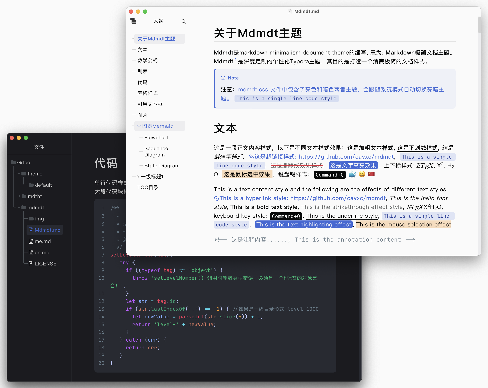
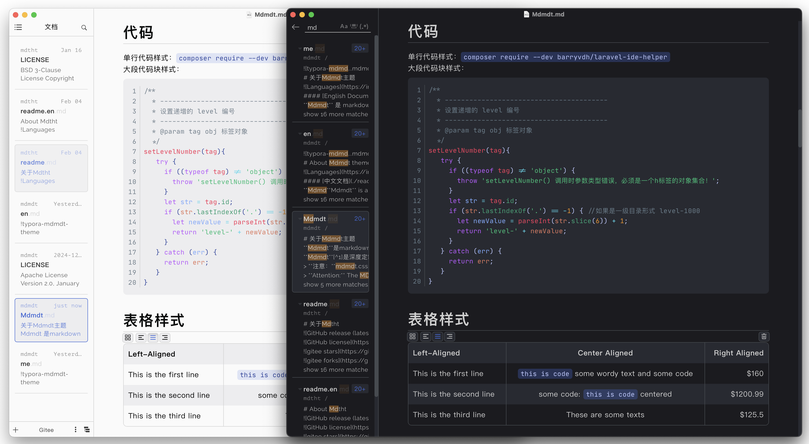
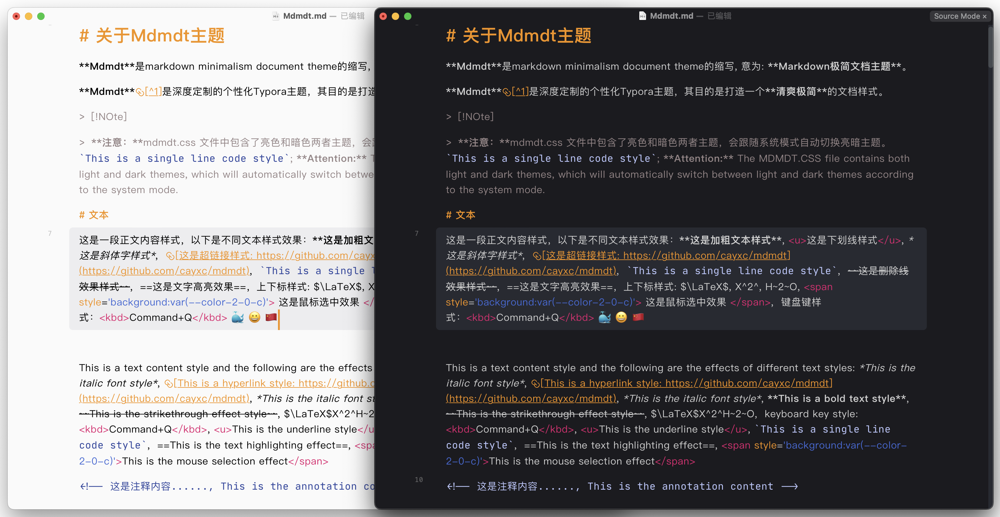
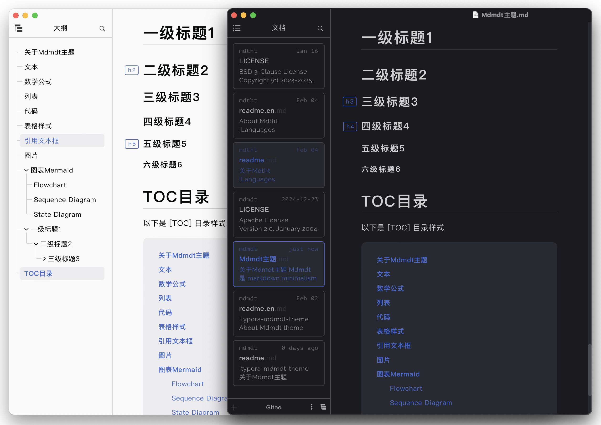
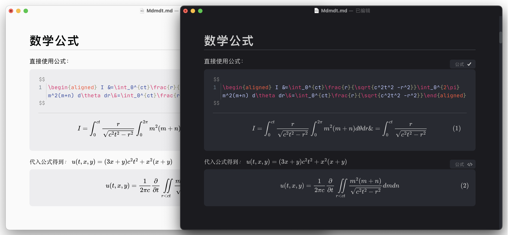
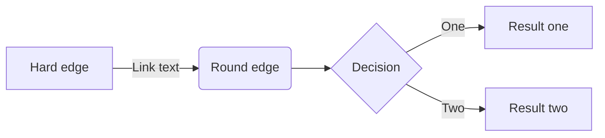
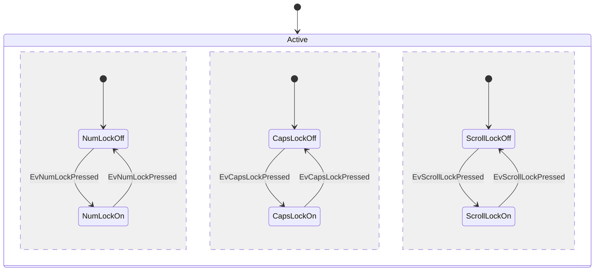
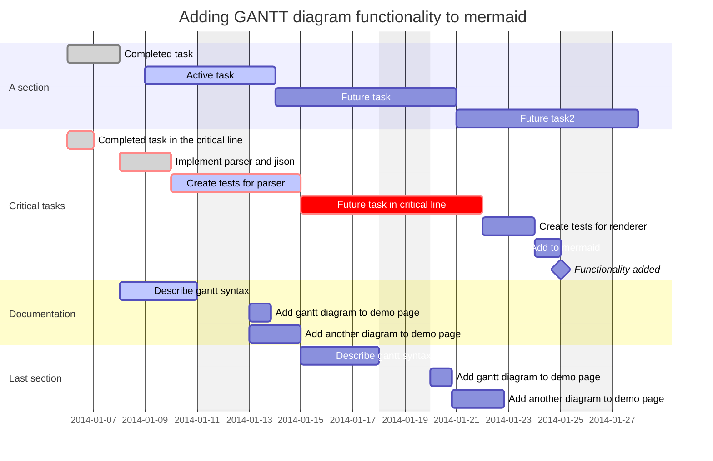

# 关于Mdmdt主题
**Mdmdt **是 markdown minimalism document theme 的缩写，意为: **Markdown极简文档主题**。
**Mdmdt**[^1]是深度定制的个性化Typora主题，其目的是打造一个**清爽极简**的文档样式。

> [!NOte]
>
> **注意：**mdmdt.css 文件中包含了亮色和暗色两者主题，会跟随系统模式自动切换亮暗主题。 `This is a single line code style`
>
> **Attention:** The MDMDT.CSS file contains both light and dark themes, which will automatically switch between light and dark themes according to the system mode.

# 文本
这是一段正文内容样式，以下是不同文本样式效果：**这是加粗文本样式**, <u>这是下划线样式</u>, *这是斜体字样式*,  [这是超链接样式: https://github.com/cayxc/mdmdt](https://github.com/cayxc/mdmdt),  `This is a single line code style`,  ~~这是删除线效果样式~~,  ==这是文字高亮效果==，上下标样式: $\LaTeX$, X^2^, H~2~O, <span style='background:var(--color-2-0-c)'> 这是鼠标选中效果 </span>,  键盘键样式：<kbd>Command+Q</kbd> 🐳 😀 🇨🇳

This is a text content style and the following are the effects of different text styles: **This is a bold text style**,  [This is a hyperlink style: https://github.com/cayxc/mdmdt](https://github.com/cayxc/mdmdt), *This is the italic font style*, ~~This is the strikethrough effect style~~, <u>This is the underline style</u>, `This is a single line code style`,  keyboard key style: <kbd>Command+Q</kbd>,  $\LaTeX$ X^2^H~2~O, ==This is the text highlighting effect==, <span style='background:var(--color-2-0-c)'>This is the mouse selection effect</span>  🐳 😀 🇨🇳

<!-- 这是注释内容......, This is the annotation content -->

# 数学公式

直接使用公式：
$$
\begin{aligned} I &=\int_0^{ct}\frac{r}{\sqrt{c^2t^2 -r^2}}\int_0^{2\pi} m^2(m+n) d\theta dr\&=\int_0^{ct}\frac{r}{\sqrt{c^2t^2 -r^2}}\end{aligned}
$$
$$ 代入公式得到： $$ $$u(t,x,y) = (3x+y) c^2 t^2 + x^2(x+y)$$

$$
u(t,x,y) = \frac{1}{2\pi c} \frac{\part}{\part t} \iint\limits_{r<ct} \frac{m^2(m+n)}{\sqrt{c^2t^2 -r^2 }}dmdn
$$

# 列表

这些是列表样式效果:


1. 这是有序列表 A
2. 这是有序列表 B

- This is Item 1.
- This is Item 2.
- [x] Something is Not TODO.
- [ ] Something is DONE.
---

1. 这是有序列表 A
2. 这是有序列表 B
    1. 这是有序列表 A
    2. 这是有序列表 B

- This is Item 1.
- This is Item 2.
    - This is Item 1.
    - This is Item 2.

---
这是嵌套列表样式：

1. 这是有序列表 A
2. 这是有序列表 B
    - This is Item 1.
    - This is Item 2.
        - [x] Something is Not TODO.
        - [ ] Something is DONE.

- 这是有序列表 A
- 这是有序列表 B
    1. This is Item 1.
    2. This is Item 2.
        - [ ] Something is Not TODO.
        - [x] Something is DONE.

# 代码

单行代码样式：`composer require --dev barryvdh/laravel-ide-helper`

大段代码块样式：

```javascript
/**
  * ----------------------------------------
  * 设置递增的 level 编号
  * ----------------------------------------
  * @param tag obj 标签对象
  */
setLevelNumber(tag){
   try {
     if ((typeof tag) != 'object') {
       throw 'setLevelNumber() 调用时参数类型错误，必须是一个h标签的对象集合！';
     }
     let str = tag.id;
     if (str.lastIndexOf('.') == -1) { //如果是一级目录形式 level-1000
       let newValue = parseInt(str.slice(6)) + 1;
       return 'level-' + newValue;
     }
   } catch (err) {
     return err;
   }
}
```

# 表格样式

| Left-Aligned            |                Center Aligned                | Right Aligned |
| :---------------------- | :------------------------------------------: | ------------: |
| This is the first line  | `this is code` some wordy text and some code |          $160 |
| This is the second line |      some code: `this is code` centered      |      $1200.99 |
| This is the third line  |             These are some texts             |        $125.5 |

# 引用文本框

> [!NOTE]
>
> This is a Note text box ...... `this is code style`
>
> > This is a Note text box ......

> [!TIP]
>
> - `this is code` This is a Tip text box ......
>
> - ```bash
>  these are  codes...
>   ...
>   ```
>
> - This is a Tip text box ......
>
> 1. This is itemA
> 1. This is itemB
> 1. This is itemC

> [!IMPORTANT]
>
> This is a Important text box ......
>

> [!WARNING]
>
> This is a Warning text box ......

> [!CAUTION]
>
> `this is  code` This is a Caution text box ......

# 个性化图文布局
## 单张图片



## 多图并排

图片的个性化排列使用方式是将图片放到一个容器中，该容器为 `<section>`  标签，如下所示:

1. 直接输入`<section>` 然后回车，如下：

2. ```html
   <section>
            
   </section>
   ```

3. 在 `<section>` 标签中插入图片，如下：

4. ```html
   <section>
     <!-- 想要几张图并排，就在此处插入几个  标签: </img> -->   
     </img>
     </img> <!-- 单独设置图片的宽度为200px -->
     </img>
   </section>
   ```

**效果预览**：

<section>
 </img>
 </img>
</section>

---

<section>
 </img>
 </img>
 </img>
</section>

---


## 多张图其他排列方式

一张大图在左，多张小图在右的图片排列，如下：

```html
<!-- 一张大图在左，多张小图在右 -->
<section> 
  </img> <!-- 这是第1列 -->
  <span style="width: 240px">  <!-- 这是第2列 -->
     </img>
 	 </img>
	 </img>
  </span>
</section>
```
**效果预览**：

<section>
 </img>
 <span style="width: 240px">
    </img>
 	</img>
	</img>
 </span>
</section>

---

一张大图在右，多张小图在左的图片排列，如下：

```html
<!-- 一张大图在右，多张小图在左 -->
<section> 
 <span style="width: 240px"> <!-- 这是第1列 -->
    </img>
 	</img>
	</img>
 </span>
 </img> <!-- 这是第2列 -->
</section>
```
**效果预览**：

<section> 
 <span style="width: 240px">
    </img>
    </img>
	</img>
 </span>
 </img>
</section>


## 图文并排

图文的个性化排列使用方式是将图片和文字放到一个容器中，该容器为 `<section>`  标签，如下所示:

1. 直接输入 `<section>` 然后回车，如下：

2. ```html
   <section>
            
   </section>
   ```

3. 在 `<section>` 标签中插入图片和文字，如下：

4. ```html
   <!-- 图片和单段文字排列示例 -->
   <section>
       </img>  <!-- 这是第1列 -->
   	<span>这是文字在右，图片在左，图片和文字各占总宽度的50%的图文并排的样式。</span> <!-- 这是第2列 -->
   </section>
   
   
   <!-- 图片和单段文字排列示例 -->
   <section>
   	<span>这是文字在左，图片在右，图片和文字各占总宽度的50%的图文并排的样式。</span> 
       </img>  
   </section>
   
   
   <!-- 图片和多段文字排列示例 -->
   <section>
       </img> <!-- 这是第1列 -->
       <span style="width: 150px">  <!-- 这是第2列，且单独设置该列的宽度为150px -->
           <span>这是多段文字......</span> 
           <span>这是文字在右，图片在左，图片和文字各占总宽度的50%的图文并排的样式。</span>
           <span>这是多段文字......</span> 
   	</span>
   </section>
   
   
   <!-- 图片居中，文字在两边的排列示例 -->
   <section>
       <span>这是第1列，这是图片居中，文字在两边的样式</span> <!-- 这是第1列 -->
       </img>  <!-- 这是第2列, 单独设置图片的宽度为200px -->
   	<span>这是第3列，列的宽度比第1列小</span>          <!-- 这是第3列 -->
   </section>
   ```

**效果预览**：

<section>
    </img> 
	<span>这是单段文字，文字在右，图片在左，图片和文字各占总宽度的50%的图文并排的样式。</span> 
</section>

---

<section>
	<span>这是单段文字，文字在左，图片在右，图片和文字各占总宽度的50%的图文并排的样式。</span> <!-- 这是第1列 -->
    </img>  <!-- 这是第2列 -->
</section>

---

<section>
    </img>
    <span>
        <span>这是多段文字......</span>
        <span>这是文字在右，图片在左，图片和文字各占总宽度的50%的图文并排的样式。</span>
        <span>这是多段文字......</span>
	</span>
</section>

---

<section>
    <span>这是第1列内容<br>这是图片居中，两边是文字，且两边文字设置相同宽度的样式</span> <!-- 这是第1列 -->
    </img> <!-- 这是第2列 -->
	<span>这是第3列内容<br>这是图片居中，两边是文字，且两边文字设置相同宽度的样式</span> <!-- 这是第3列 -->
</section>


<section>
    <span>这是中间是图片，两边是文字的图文样式<br>需要注意：该列文字内容较多，且未设置宽度。<strong>列的宽度比第3列大</strong></span>
    </img>
	<span>这是第3列内容</span>
</section>


---

图片和文字，图片设置宽度示例：

```html
<!-- 这是文字在右，图片在左的示例 -->
<section>
   </img>
   <span>这是文字在右，图片在左，且设置图片的宽度（如图片宽可以设置为：200px）的图文并排的样式。</span>
</section>

<!-- 这是文字在左，图片在右的示例 -->
<section>
    <span>这是文字在左，图片在右，设置图片宽度为 200px 的图文并排的样式！</span>
    </img>
</section>
```
**效果预览**：

---

<section>
   </img>
   <span>这是文字在右，图片在左，且设置图片宽度（如图片宽可以设置为：200px）的图文并排的样式。</span>
</section>

<section>
    <span>这是文字在左，图片在右，且设置图片宽度为 200px 的图文并排的样式！</span>
    </img>
</section>


---

> [!Important]
>
> **注意：**
>
> 由于图片排列的容器 `<section>` 采用的是grid布局，会根据 `<section>` 中有几列和每列里的内容自动分配每一列的宽度。
>
> 在进行图片、图片和文字排列时，如果将某一列的宽度设置为 xx%的形式，则该列的实际宽度并<u>不一定是内容区宽度的 xx%</u>，而是 `<section>` 容器中当前列宽度的 xx%，且当前列的宽度还受到了里面内容的影响。
>
> **基于以上原因，建议在单独设置某一列宽度的时候，尽可能采用具体的值（如: style="width: 200px"），不要采用 xx%（如: style="width: 50%"）的形式。**
>
> 示例：
>
> ```html
> <!-- <section> 排列图片的容器，宽度为内容区（也就是书写区）的宽度 -->
> <section>
>    	<!-- 此时是2列 -->
>    	</img>
>  	<!-- 此处的 width:50% ，实际只有内容区宽度的25%（一共2列，每一列宽度50%，50%*50% => 25%）-->
>      </img> 
> </section>
> 
> <section>
>    	<!-- 此时是3列： img, span, span -->
>    	</img>  <!-- 第1列 -->
> 	<span>....</span>  <!-- 第2列 -->
> 	<span>             <!-- 第3列 -->
>    	<span>这是其段落他文字...</span>
>             <!-- 此处的 width:50% ，实际只有内容区宽度的16.5%（一共3列，每一列宽度33.33%，33.33%*50% => 16.65%）-->
>             <span style="width:50%">这是多段文字</span>
>             <span>这是其段落他文字...</span>
> 	</span>
> </section>
> ```

除了以上展示的排列方式，更多的排列形式，还请自行探索 ......

# 图表Mermaid

以下是 **Mermaid图表** 部分示例，更多图表类型请参考：[Mermaid图表](https://mermaid.js.org)






## Flowchart

## Sequence Diagram

## State Diagram


# 一级标题1

## 二级标题2

### 三级标题3

#### 四级标题4
##### 五级标题5

###### 六级标题6

# TOC目录

以下是 [TOC] 目录样式

[TOC]	

