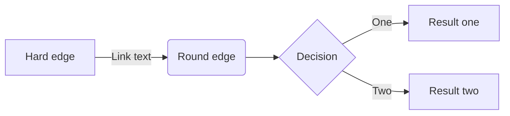
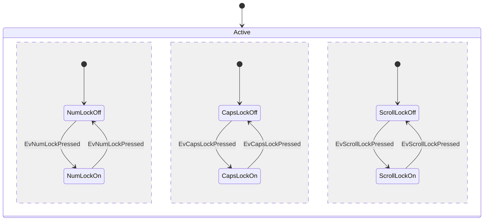
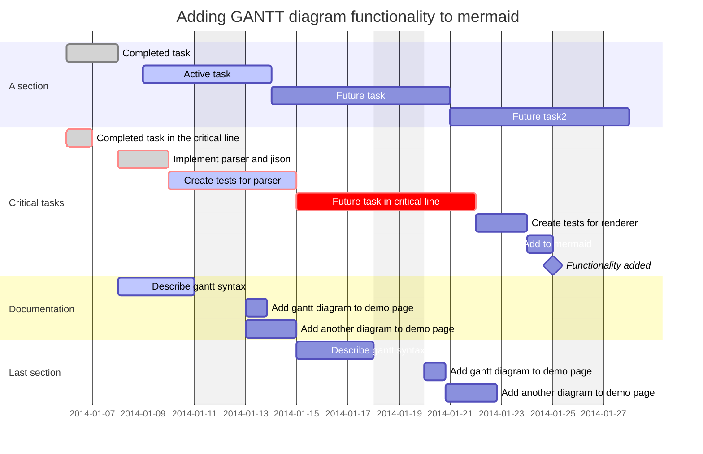

# 关于Mdmdt主题

[English Document](./readme.md)

**Mdmdt** 是markdown minimalism document theme 的缩写，意为：**Markdown极简文档主题**。
**Mdmdt**[^1]是深度定制的个性化Typora主题，其目的是打造一个**清爽极简**的文档样式。
> [!NOte]
>
> **注意：**mdmdd.css 文件中包含了亮色和暗色两者主题，会跟随系统模式自动切换亮暗主题 `this is code style`

## 文本
这些是文本样式效果： [这是超链接](typora.io),  **这是加粗文本**,  *这是斜体字*,  `this is code style` ， <u>这是下划线样式</u>,   ~~这是删除线效果~~,   ==这是文字高亮效果==， 上下标: $\LaTeX$, X^2^, H~2~O,   <span style='background:var(--color-2-0-c)'> 这是鼠标选中效果 </span>, <kbd>Command+Q</kbd>  🐳 😀 🇨🇳
[链接引用]: https://github.com/cayxc/mdmdt	"链接标题"
[^1]: *Forked* from https://github.com/cayxc/mdmdt
<!-- 这是注释内容...... -->

# 列表

这些是列表样式效果:


1. 这是有序列表 A
2. 这是有序列表 B

- This is Item 1.
- This is Item 2. 
- [x] Something is Not TODO.
- [ ] Something is DONE.
---

1. 这是有序列表 A
2. 这是有序列表 B
   1. 这是有序列表 A
   2. 这是有序列表 B

- This is Item 1.
- This is Item 2.
   - This is Item 1.
   - This is Item 2. 

---
这是嵌套列表样式：

1. 这是有序列表 A
2. 这是有序列表 B
   - This is Item 1.
   - This is Item 2. 
      - [x] Something is Not TODO.
      - [ ] Something is DONE.

- 这是有序列表 A
- 这是有序列表 B
   1. This is Item 1.
   2. This is Item 2. 
      - [ ] Something is Not TODO.
      - [x] Something is DONE.

# 代码

单行代码：`composer require --dev barryvdh/laravel-ide-helper`

大段代码块：

```javascript
/**
  * ----------------------------------------
  * 设置递增的 level 编号
  * ----------------------------------------
  * @param tag obj 标签对象
  *
  */
 setLevelNumber (tag) {
   try {
     if ((typeof tag) != 'object') {
        throw 'setLevelNumber() 调用时参数类型错误，必须是一个h标签的对象集合！';
     }
     let str = tag.id;
     if (str.lastIndexOf ('.') == - 1) { //如果是一级目录形式 level-1000
        let newValue = parseInt (str.slice (6))+1;
        return 'level-'+newValue;
     } else {
        // ...
     }
   } catch (err) {
      return err;
   }
 }
```

# 表格样式

| Left-Aligned            |                Center Aligned                | Right Aligned |
| :---------------------- | :------------------------------------------: | ------------: |
| This is the first line  | `this is code` some wordy text and some code |          $160 |
| This is the second line |      some code: `this is code` centered      |      $1200.99 |
| This is the third line  |                   are neat                   |            $1 |

# 引用文本框

> This is a Normal text box ...... `this is code style`

> [!NOTE]
>
> This is a Note text box ......
>
> > This is a Note text box ......

> [!NOTE]
>
> This is a Note text box ......

> [!TIP]
>
> This is a Tip text box ......

> [!IMPORTANT]
>
> This is a Important text box ......

> [!WARNING]
>
> This is a Warning text box ......

> [!CAUTION]
>
> This is a Caution text box ......

# 图片


# 图表Mermaid

以下是 **Mermaid图表** 部分示例，更多图表类型请参考：[Mermaid图表](https://mermaid.js.org)





# 一级标题1

## 二级标题2

### 三级标题3

#### 四级标题4
##### 五级标题5

###### 六级标题6

# TOC目录

以下是 [TOC] 目录样式

[TOC]	
