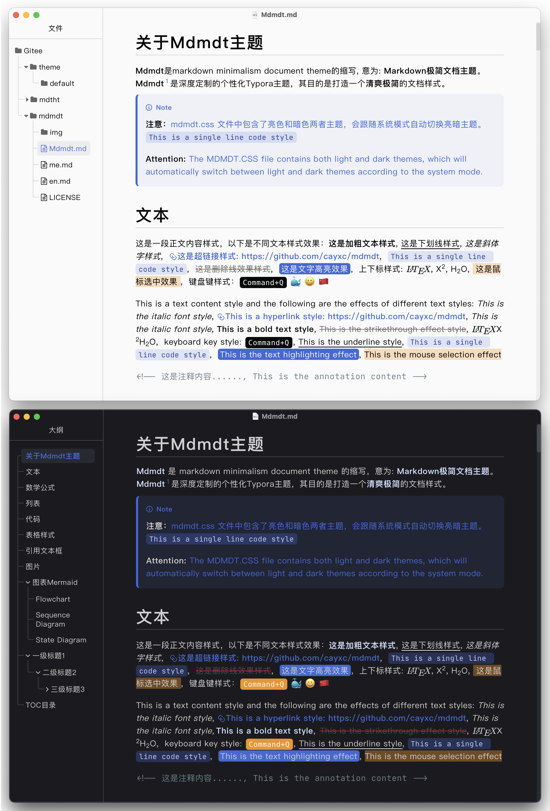
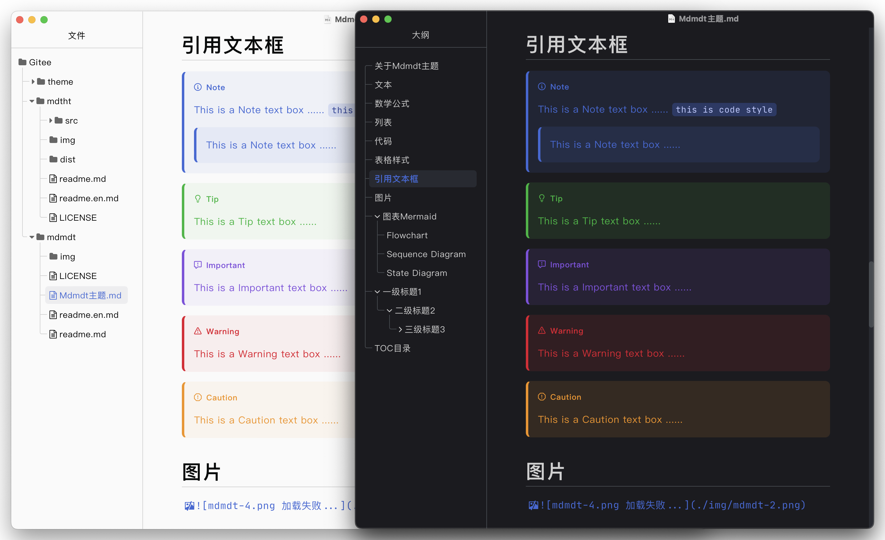
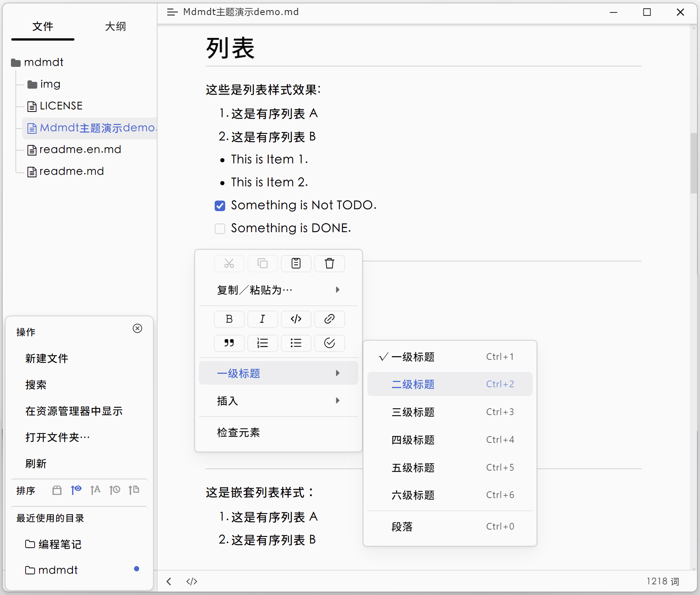

# About Mdmdt theme

#### [中文文档](./readme.zh.md)

**Mdmdt** is an abbreviation for Markdown Minimalism Document Theme, meaning: Markdown Minimalism Document Theme.**Mdmdt** is a deeply customized personalized Typora theme, aimed at creating a **refreshing and minimalist** document style. The **Mdmdt** theme has now been included in the [official Typora theme library](https://theme.typoraio.cn).

Compared to the default theme style, the following aspects have been mainly modified:
1. Simple and comfortable color matching style
2. Modify the title style
3. Modify the table style
4. Modify the reference box style
5. Add rounded corner style to the image
6. Add highlight style to code
7. Modify file tree, outline, and document list styles
8. Automatic follow system's light/dark theme mode (can be set separately for light/dark themes)
9. Modify other UI styles

> [!IMPORTANT]
>
> **Attention:** This theme has only been tested in Windows and MacOS environments, and has not been tested in Linux environments. Please be aware when using it!

# Preview

---

# How to use it

Using custom themes is very simple, as follows:

1. Open `Preferences` -> `Appearance` -> `Open Theme Folder`
2. Copy the downloaded `mdmdt.cs`  file to the theme folder.
3. **Exit Typora and reopen**，In the `Menu Bar` -> `Themes`, Select **Mdmdt** theme and complete the theme switch.

> [!NOTE]
> 
> **Note:** The mdmdt.css file contains both bright and dark themes, which will automatically switch between bright and dark themes according to the system mode.

##### Use separate Light/Dark theme

If you only want to use a separate bright or dark theme, the method is as follows:
1. Open `Preferences` -> `Appearance` -> `Open Theme Folder`
2. Copy `mdmdt-light.css` or `mdmdt-dark.css ` to the theme folder.
3. **Exit Typora and reopen**，In the `Menu Bar` -> `Themes`, Select **Mdmdt Light** or **Mdmdt Dark** theme and complete the theme switch.

# Modify font
If you are not satisfied with the font, you can refer to the following methods to modify the corresponding font:

1. Modify the text font and find: `font-family: "PingFang SC", "Microsoft YaHei", Arial, "Helvetica Neue", Helvetica, sans-serif;` ,  Then add the font you want to use in the first position after "font-family:",  such as: `font-family:  "The font name you want to use", "PingFang SC", ..., sans-serif;`

2. Modify the code font and find: `--monospace: "JetBrains Mono", "Source Code Pro", "Fira Code", Consolas, Inconsolata, "Cascadia Code", Monaco, "Ubuntu Mono", monospace;`，Then add the font you want to use in its first position,  such as: `--monospace:  "The font name you want to use", "JetBrains Mono", ..., monospace;`

**Attention: The prerequisite for changing the font is that the corresponding font is installed on your computer, otherwise the modification is invalid;** If you are not familiar with the "font-family" property of CSS, you can refer to it here: https://developer.mozilla.org/zh-CN/docs/Web/CSS/font-family

# Export HTML

To export an HTML file, you can directly select the current theme to export HTML
**If you want to export HTML files with customizable styles, you can use the Mdtht plugin:**

Plugin homepage address:  [Mdtht-Github-address](https://github.com/cayxc/Mdtht)  [Mdtht-Gitee-address]( https://gitee.com/cayxc/mdtht )
This plugin provides the following rich features:

1. Follow the system to automatically switch between bright and dark color modes.
2. Manually switch between light and dark color modes.
3. Automatically generate table of contents numbers and body area title indexes.
4. You can choose to convert the first title into an article title and center the title.
5. Automatically correct the directory hierarchy based on the position of the titles in the main text.
6. Show/hide directory index numbers.
7. Switch between three types of directory button styles.
8. Automatically track the current reading area location to the current directory and upper level directory.
9. Expand the screwdriver directory with one click.
10. One click expand and collapse the sidebar.
11. Catalog search.
12. Code highlighting.
13. Text Shadow Mode.

Please refer to the plugin homepage for specific details of **mdtht.js** plugin.

**Export mdtht.js as an HTML rendering (Light theme)**

---

**Export mdtht.js as an HTML rendering (Dark theme)**

---

---
🐳 If you like the style of this document, please provide a star 😄， If there are any issues during use, please submit them in a timely manner and I will handle them as soon as I see them.

