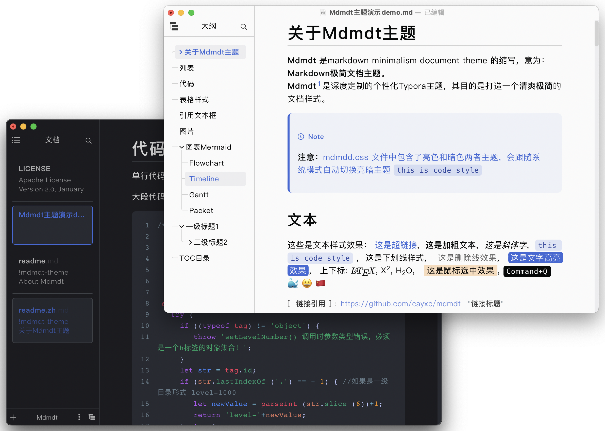
# About Mdmdt theme

#### [中文文档](./readme.zh.md)

**Mdmdt** is an abbreviation for Markdown Minimalism Document Theme, meaning: Markdown Minimalism Document Theme.
**Mdmdt** is a deeply customized personalized Typora theme, aimed at creating a **refreshing and minimalist** document style. The **Mdmdt** theme has now been included in the [official Typora theme library](https://theme.typoraio.cn).

Compared to the default theme style, the following aspects have been mainly modified:
1. A simple and comfortable color scheme style
2. Add rounded corner style
3. Title Style
4. Table Style
5. Reference box style
6. Image Style
7. Code Highlight Style
8. File Tree Style
9. Document list style: changed to card structure
10. Outline style: Added a directory tree structure, making the directory hierarchy more concise and clear
11. Automatically follow the bright/dark theme mode of the system (the bright/dark theme can be set separately)

> [!IMPORTANT]
>
> **Attention**: This theme has only been tested in Windows and MacOS environments, and has not been tested in Linux environments. Please be aware when using it!

# Effect

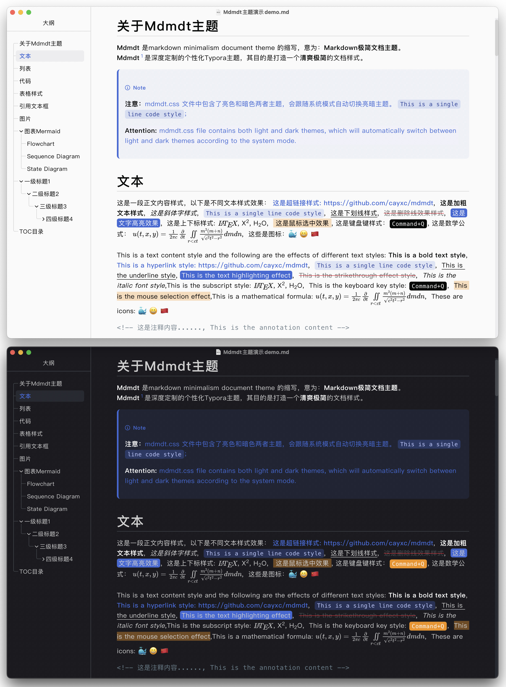
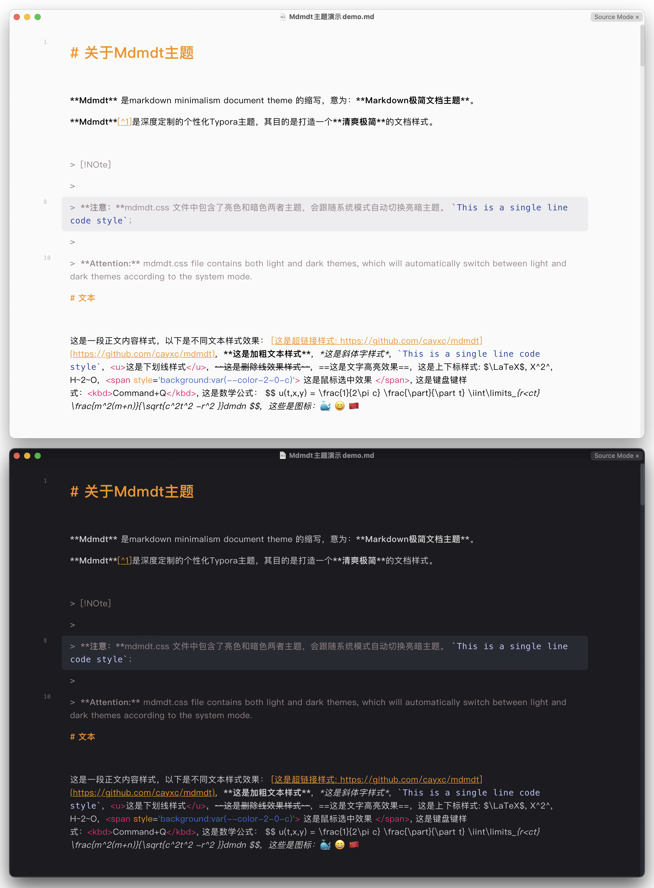
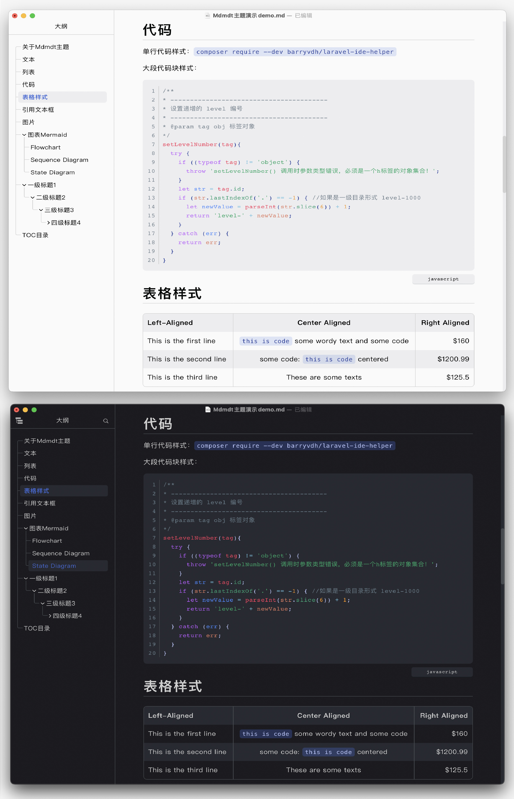
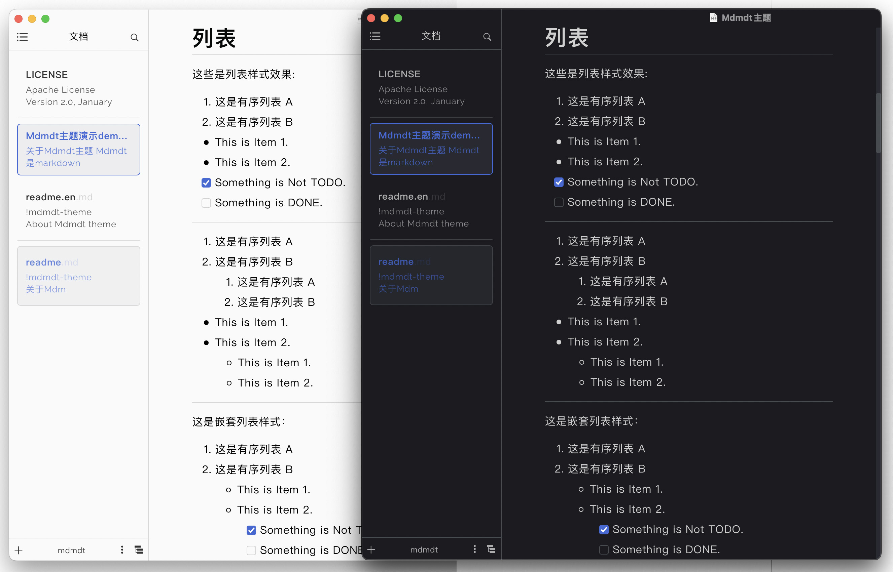
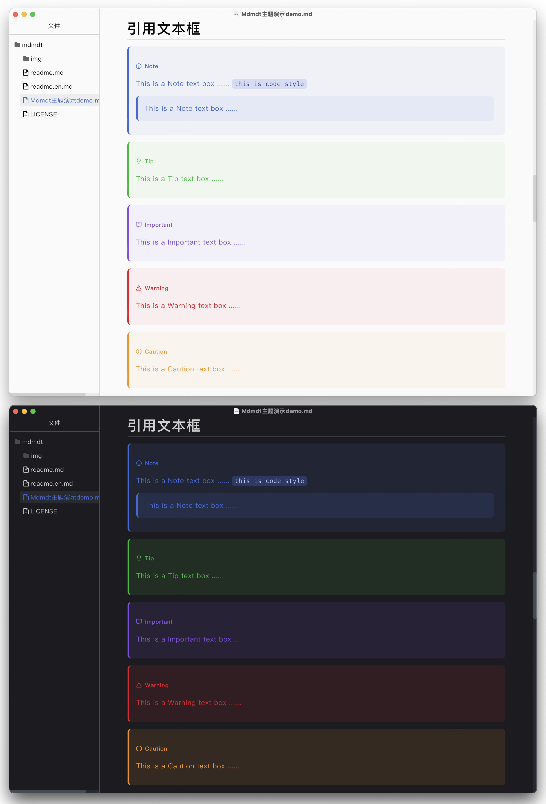
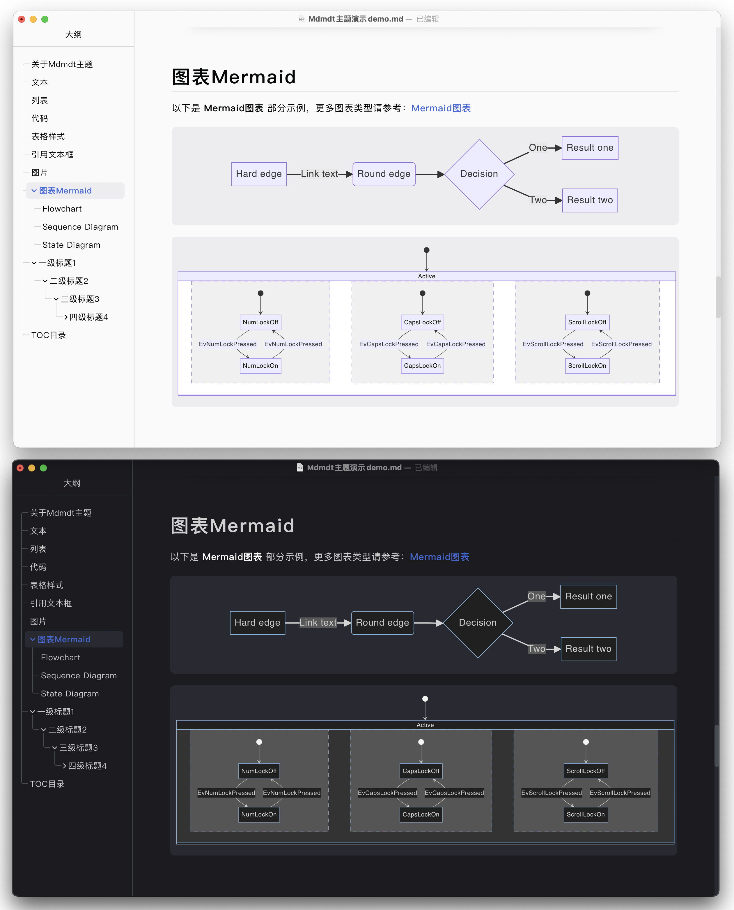
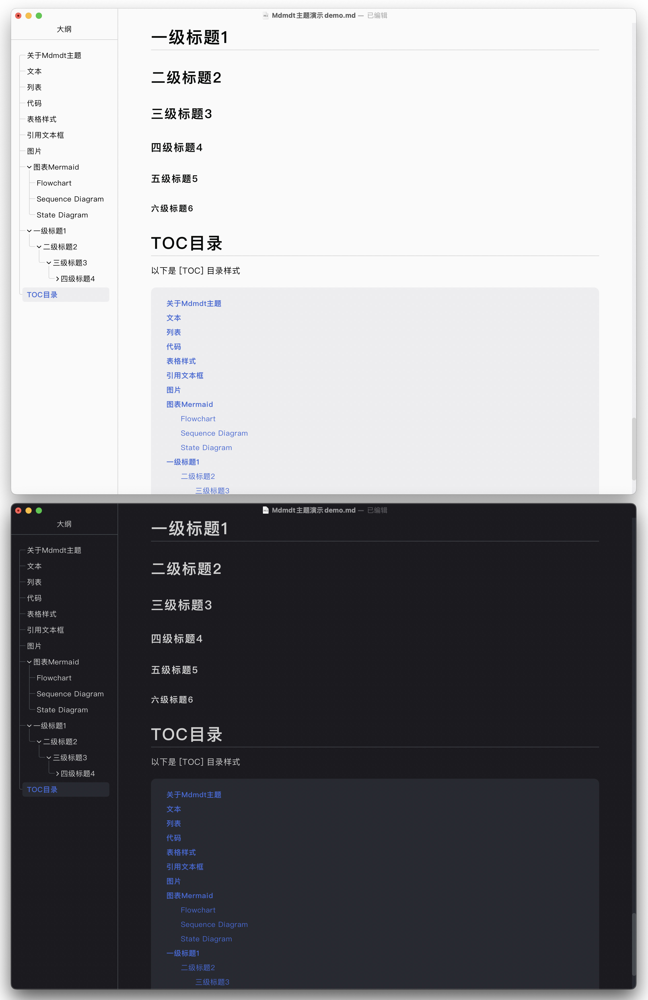

---

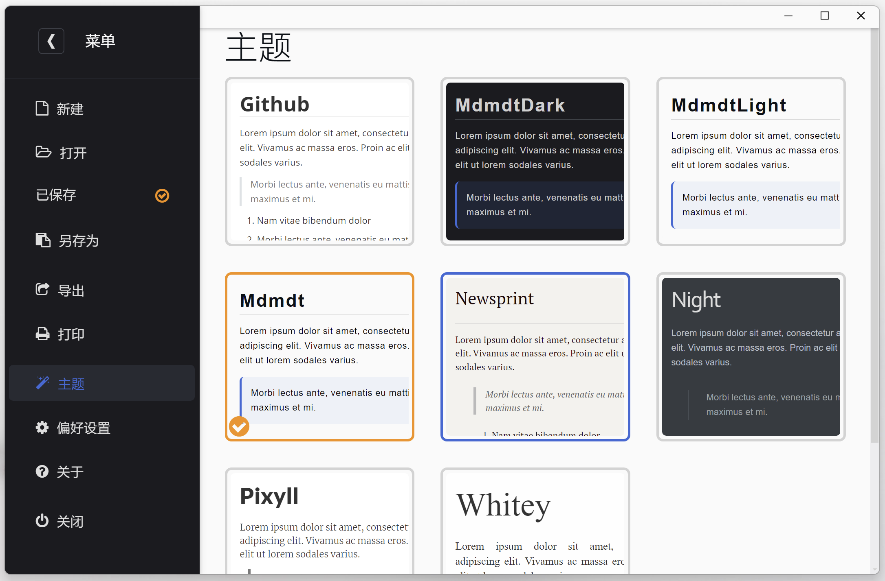
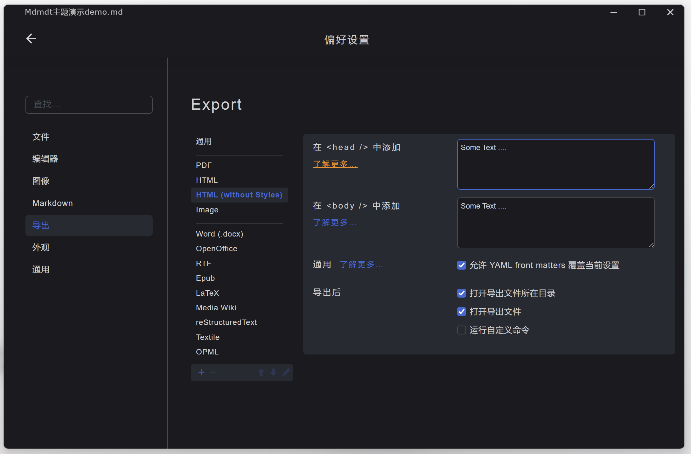
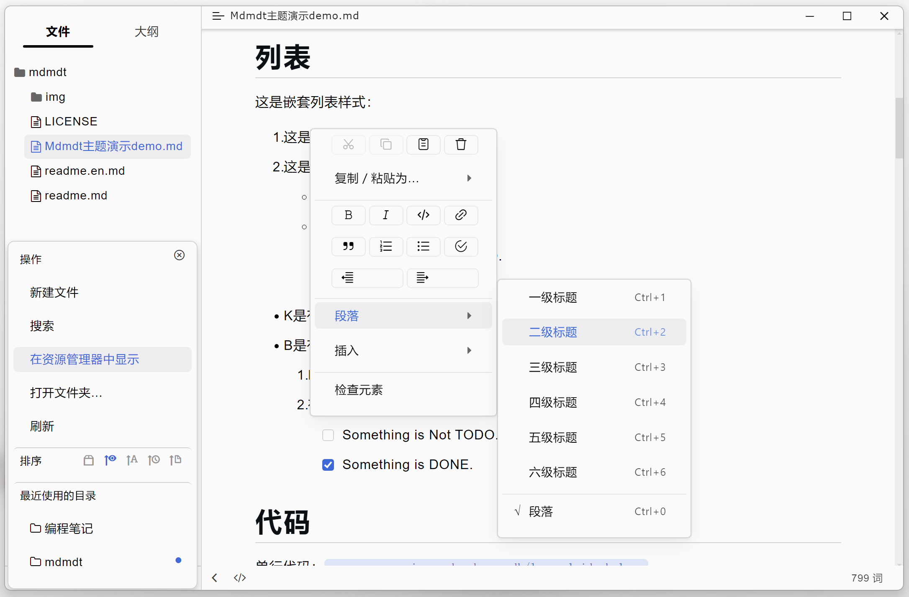
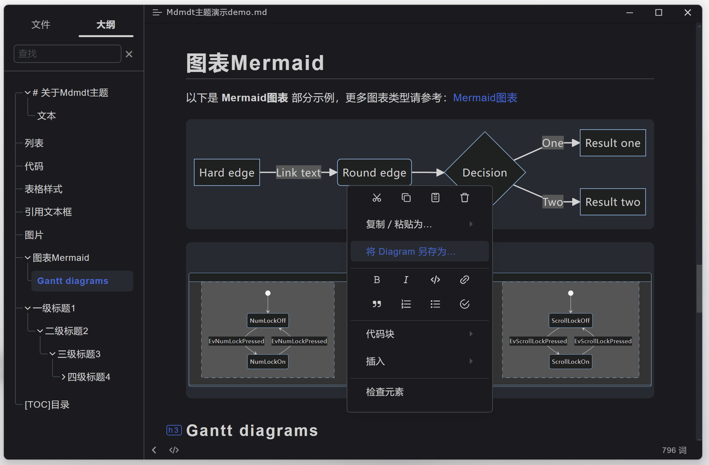

# How to use it

Using custom themes is very simple, as follows:

1. Open `Preferences` -> `Appearance` -> `Open Theme Folder`
2. Copy the downloaded `mdmdt.cs`  file to the theme folder.
3. **Exit Typora and reopen**，In the `Menu Bar` -> `Themes`, Select **Mdmdt** theme and complete the theme switch.

> [!NOTE]
> **Note:** The mdmdt.css file contains both bright and dark themes, which will automatically switch between bright and dark themes according to the system mode.

##### Use separate Light/Dark theme

If you only want to use a separate bright or dark theme, the method is as follows:
1. Open `Preferences` -> `Appearance` -> `Open Theme Folder`
2. Copy `mdmdt-light.css` or `mdmdt-dark.css ` to the theme folder.
3. **Exit Typora and reopen**，In the `Menu Bar` -> `Themes`, Select **Mdmdt Light** or **Mdmdt Dark** theme and complete the theme switch.

# Modify font

If you are not satisfied with the font, you can modify the corresponding font as follows:

1. Modify the font of the main text, find `body {font-family:"PingFang SC",..., !important;}` 、`body.os-windows {font-family: "Microsoft YaHei",..., !important;}` and `textarea {...}`, and add the font you want to use at the beginning of `font-family:`, such as `font-family: "name of the font you want to use", "Microsoft YaHei", ..., !important;`

2. Modify the font of the code, find `code, tt {...}` and `pre {...}`, and add `font-family: "name of the font you want to use" !important;`  Then modify `.os-windows pre,.os-windows code {font-family: initial !important;}` , such as `font-family: "name of the font you want to use" !important;`

**Attention: The prerequisite for changing the font is that the corresponding font is installed on your computer, otherwise the modification is invalid.**

# Export HTML

To export an HTML file, you can directly select the current theme to export HTML.

**If you want to export HTML files with customizable styles, you can use the Mdtht plugin:**

Plugin homepage address:  [Mdtht-Github-address](https://github.com/cayxc/Mdtht)  [Mdtht-Gitee-address]( https://gitee.com/cayxc/mdtht )
This plugin provides the following rich features:

1. Follow the system to automatically switch between bright and dark color modes.
2. Manually switch between light and dark color modes.
3. Automatically generate table of contents numbers and body area title indexes.
4. You can choose to convert the first title into an article title and center the title.
5. Automatically correct the directory hierarchy based on the position of the titles in the main text.
6. Show/hide directory index numbers.
7. Switch between three types of directory button styles.
8. Automatically track the current reading area location to the current directory and upper level directory.
9. Expand the screwdriver directory with one click.
10. One click expand and collapse the sidebar.
11. Catalog search.
12. Code highlighting.
13. Text Shadow Mode.

Please refer to the plugin homepage for specific details of **mdtht.js** plugin.

**Export mdtht.js as an HTML rendering (Light theme)**

---

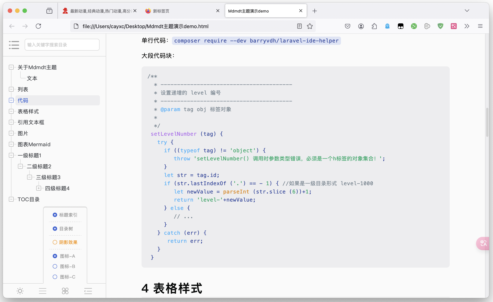**Export mdtht.js as an HTML rendering (Dark theme)**

---

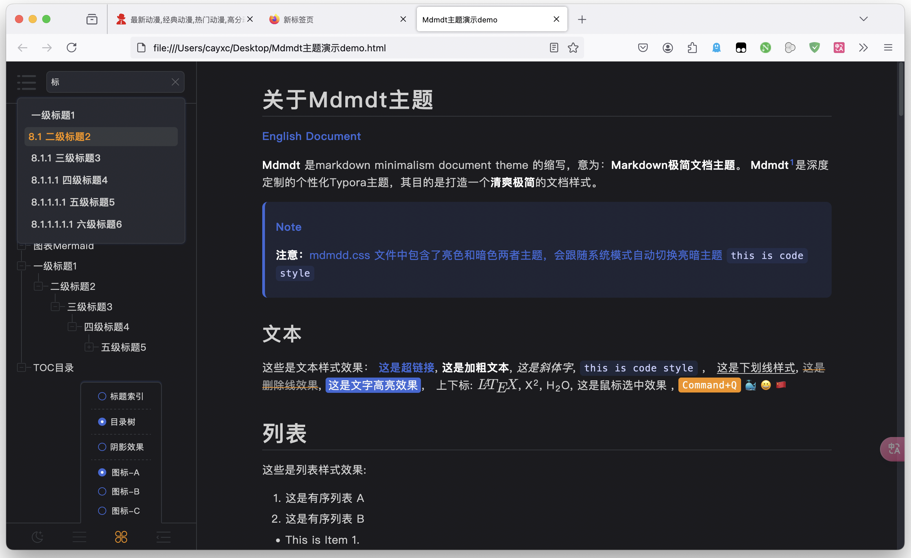

---

If you like the style of this document, please provide a star， If there are any issues during use, please submit them in a timely manner and I will handle them as soon as I see them.
