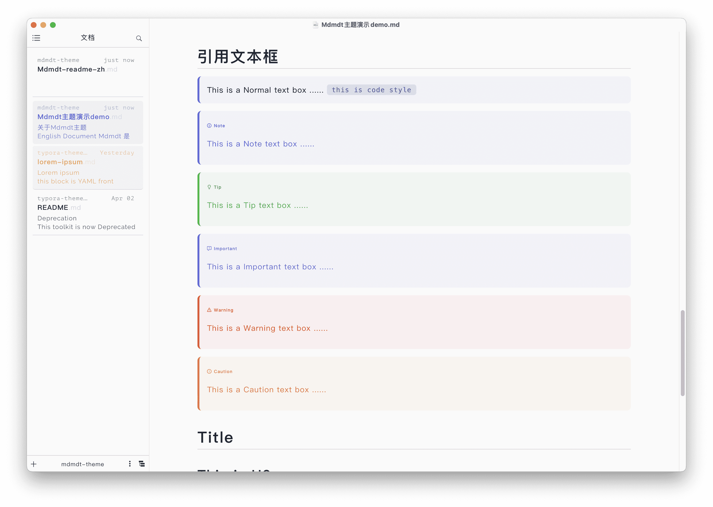
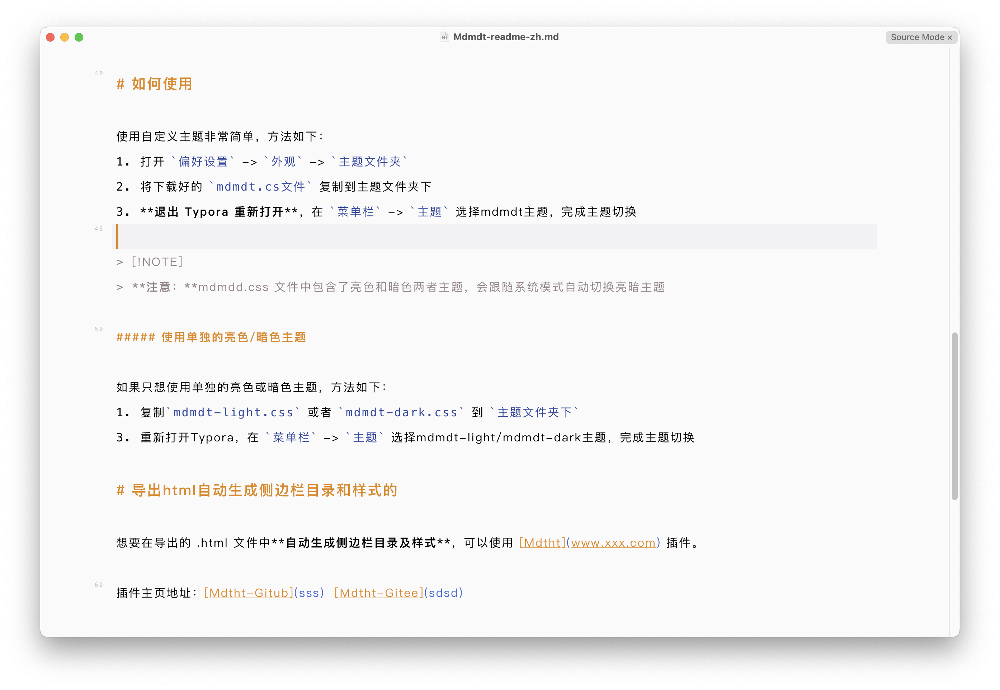
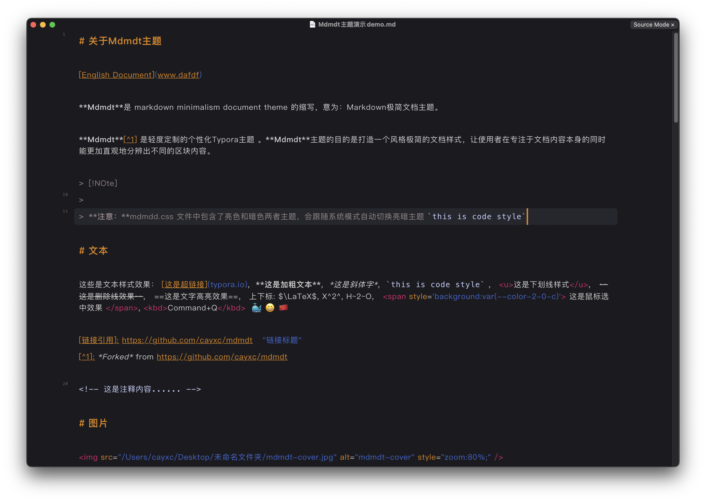

# About Mdmdt theme

[中文文档](./readme.zh.md)

**Mdmdt** is the abbreviation for Markdown Minimalism document theme, meaning: Markdown Minimalist Document Theme, which is a lightly customized personalized Typora theme.

The purpose of the **Mdmdt** theme is to create a minimalist document style, allowing users to more intuitively distinguish different block contents while focusing on the document content itself.

Compared to the default theme style, the following aspects have been mainly modified:
1. A simple and comfortable color scheme style
2. Add rounded corner style
3. Title Style
4. Table Style
5. Reference box style
6. Image Style
7. Code Highlight Style
8. File Tree Style
9. Document list style: changed to card structure
10. Outline style: Added a directory tree structure, making the directory hierarchy more concise and clear
11. Automatically follow the bright/dark theme mode of the system (the bright/dark theme can be set separately)

# Design sketch

**Light Theme:**

---

**Dark Theme:**

---

**Text Box Style:**

---

**Source Code Mode:**

# How to use it

Using custom themes is very simple, as follows:

1. Open `Preferences` -> `Appearance` -> `Open Theme Folder`
2. Copy the downloaded `mdmdt.cs`  file to the theme folder.
3. **Exit Typora and reopen**，In the `Menu Bar` -> `Themes`, Select **Mdmdt** theme and complete the theme switch.

> [!NOTE]
> **Note:** The mdmdt.css file contains both bright and dark themes, which will automatically switch between bright and dark themes according to the system mode.

##### Use separate Light/Dark theme

If you only want to use a separate bright or dark theme, the method is as follows:
1. Open `Preferences` -> `Appearance` -> `Open Theme Folder`
2. Copy `mdmdt-light.css` or `mdmdt-dark.css ` to the theme folder.
3. **Exit Typora and reopen**，In the `Menu Bar` -> `Themes`, Select **Mdmdt Light** or **Mdmdt Dark** theme and complete the theme switch.

# Export HTML to automatically generate sidebar directories and styles

**To automatically generate sidebar directories and styles in the exported HTML file**, you can use the **Mdtht** plugin.

Plugin homepage address：[Mdtht-Github](https://github.com/cayxc/Mdtht)   [Mdtht-Gitee](https://gitee.com/cayxc/mdtht)

The plugin has a simple configuration (importing JavaScript and CSS) and provides rich features. Please refer to the plugin homepage for details.
> [!IMPORTANT]
>
> **Attention**: When **exporting HTML using  mdtht. js**, please select the **mdtht. css** style file that matches mdtht. js.

**Export mdth.tjs as an HTML rendering (light theme)**

---

**Export mdth.tjs as an HTML rendering (dark theme)**

---

---

🐳 If you like the style of this document, please provide a star 😄， If there are any issues during use, please submit them in a timely manner and I will handle them as soon as I see them.

