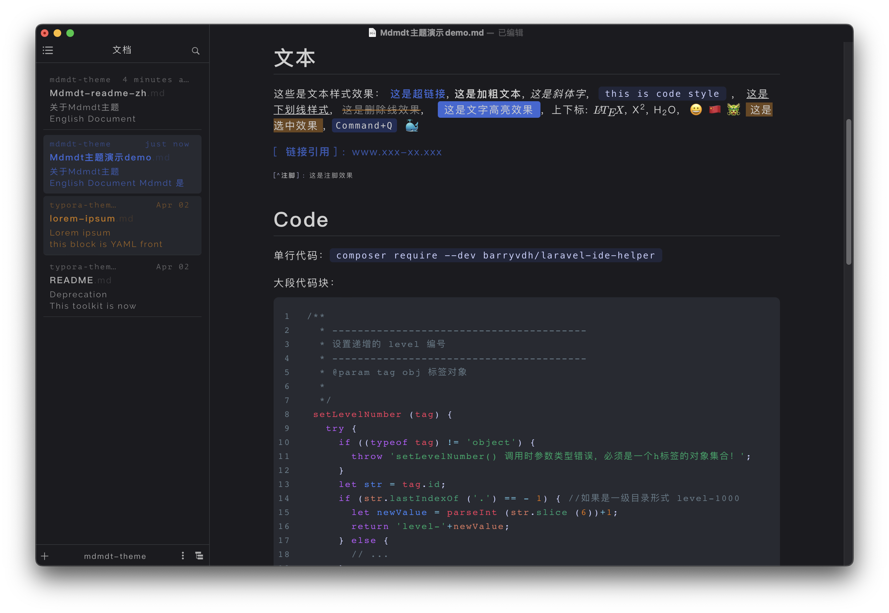
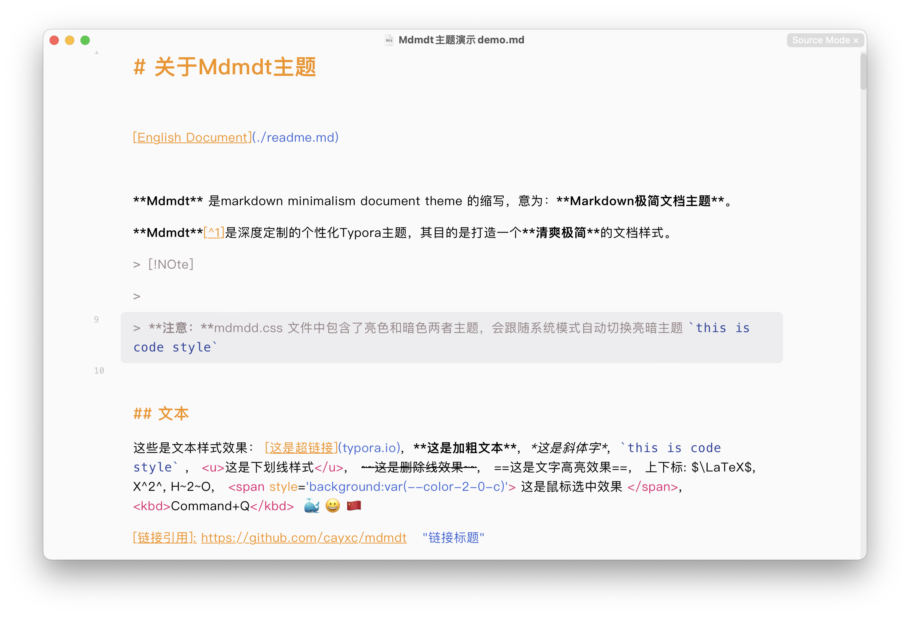
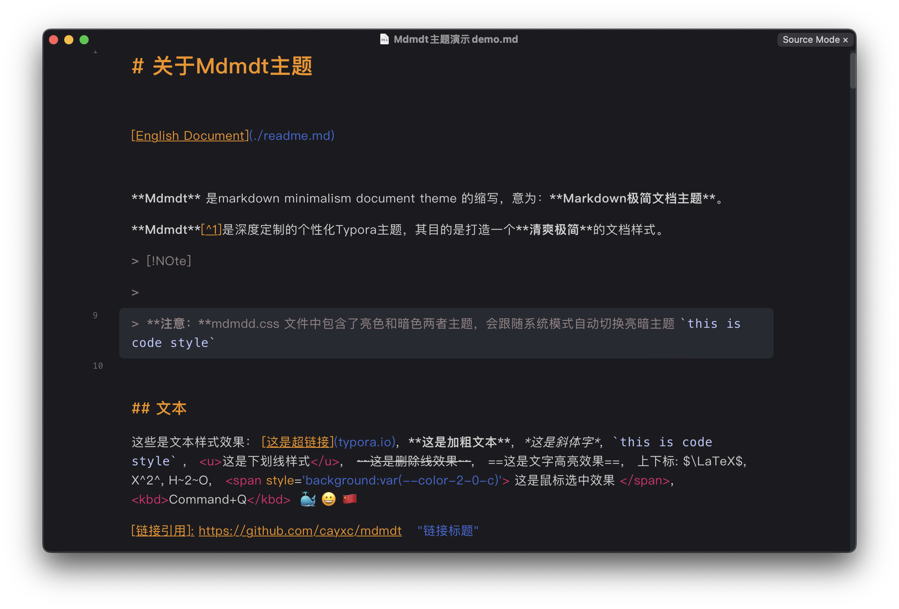
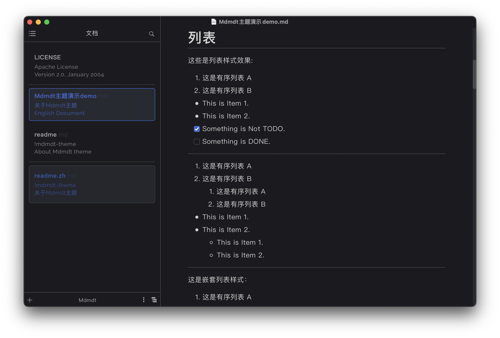
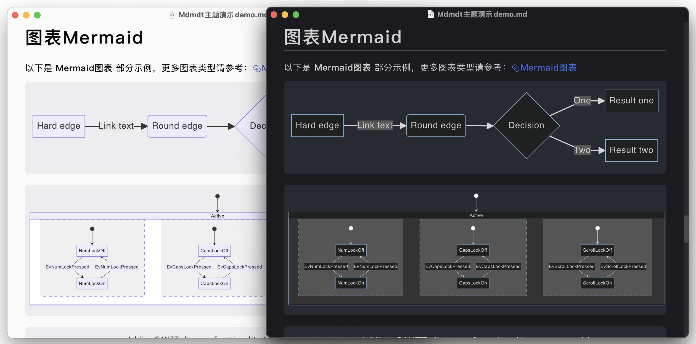
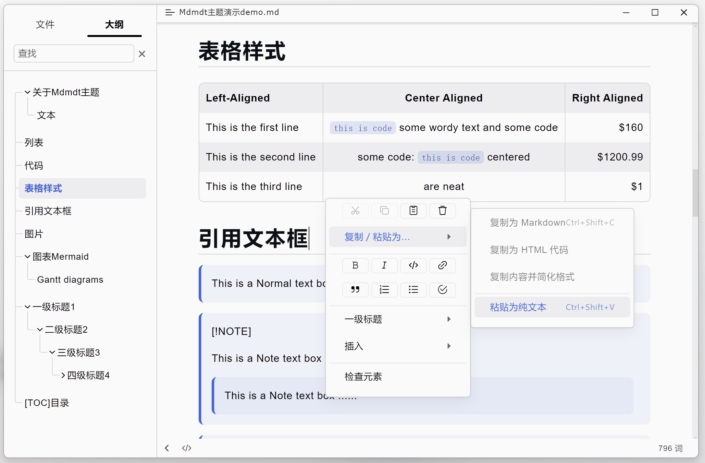
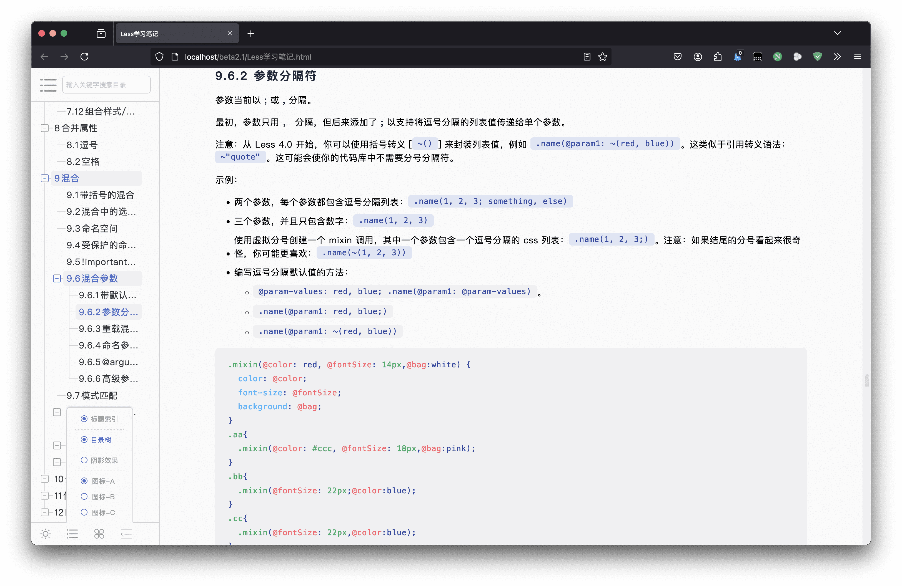
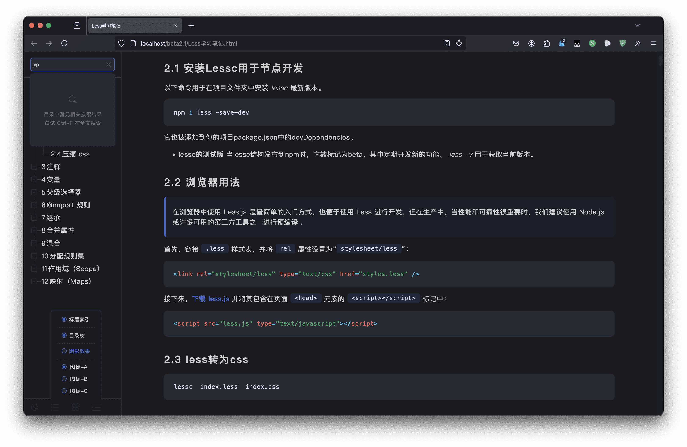

# 关于Mdmdt主题

#### [English Document](./readme.md)

**Mdmdt** 是 markdown minimalism document theme 的缩写，意为：**Markdown极简文档主题**。

**Mdmdt**是深度定制的个性化Typora主题，其目的是打造一个 **清爽极简** 的文档样式。

相比于默认主题风格主要修改了以下几个方面：
1. 简洁舒适的配色风格
2. 添加圆角样式
3. 标题样式
4. 表格样式
5. 引用框样式
6. 图片样式
7. 代码高亮样式
8. 文件树样式
9. 文档列表样式：改为卡片结构
10. 大纲样式：添加了目录树状线结构，目录层次更加简洁明了
11. 自动跟随系统的亮色/暗色主题模式（可单独设置亮/暗主题)

# 效果图

### 亮色主题：

黑色主题：

---

### 源码模式：

---
---

### 其他样式：

# 如何使用

使用自定义主题非常简单，方法如下：
1. 打开 `偏好设置` -> `外观` -> `打开主题文件夹`
2. 将下载好的 `mdmdt.cs文件` 复制到主题文件夹下
3. **退出 Typora 重新打开**，在 `菜单栏` -> `主题` 选择 **Mdmdt** 主题，完成主题切换。

> [!NOTE]
> **注意**：mdmdt.css 文件中包含了亮色和暗色两者主题，会跟随系统模式自动切换亮暗主题。

##### 使用单独的亮色/暗色主题

如果只想使用单独的亮色或暗色主题，方法如下：
1. 打开 `偏好设置` -> `外观` -> `打开主题文件夹`
2. 复制 `mdmdt-light.css` 或者 `mdmdt-dark.css` 到 `主题文件夹下`
3. 重新打开Typora，在 `菜单栏` -> `主题` 选择 **Mdmdt Ligh** 或者 **mdmdt Dark** 主题，完成主题切换。

# 导出html

想要导出 html 文件可以直接选择当前主题导出 html

**如果想要导出的 html 文件能自定义更多样式，可以使用 Mdtht 插件：**

插件主页地址：[Mdtht-Gitub地址](https://github.com/cayxc/Mdtht)   [Mdtht-Gitee地址](https://gitee.com/cayxc/mdtht)

该插件提供了如下丰富功能：

1. 跟随系统自动切换亮色/暗色模式。
2. 手动切换亮色/暗色模式。
3. 自动生成目录编号和正文区标题索引。
4. 可选择将第一个标题转换为文章标题，并将标题居中。
5. 根据正文中标题的位置自动纠正目录层级。
6. 显示/隐藏目录索引编号。
7. 3种目录按钮样式切换。
8. 根据当前阅读区位置自动追踪到所在目录和上层目录。
9. 一键展开收起子目录。
10. 一键展开收起侧边栏。
11. 目录搜索。
12. 代码高亮。
13. 文字阴影模式。

 **mdtht.js** 插件具体详情请参考插件主页。

**mdtht.js导出为 html 效果图（亮色）**

---

 **mdtht.js导出为 html 效果图（暗色）**

---

---

🐳 如果您喜欢该文档样式风格，还请给一个 star 😄，使用过程中有什么问题请及时提交 issues，看到后我会第一时间处理。

